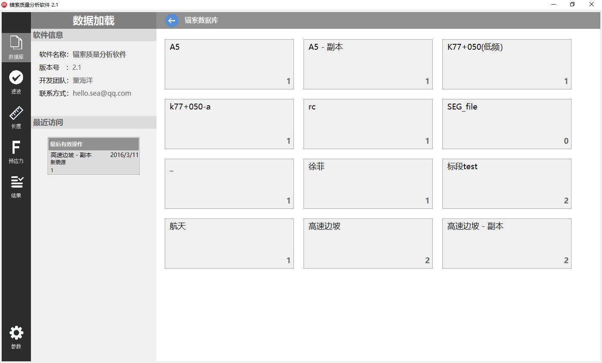
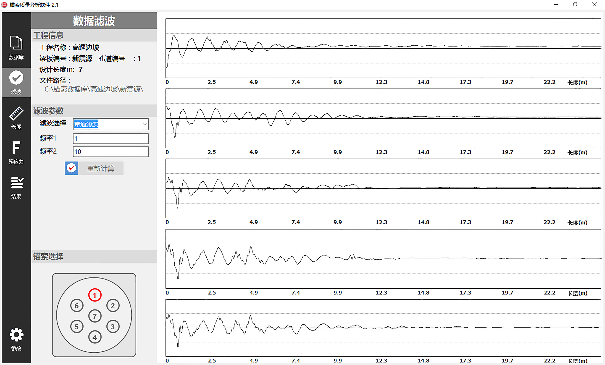
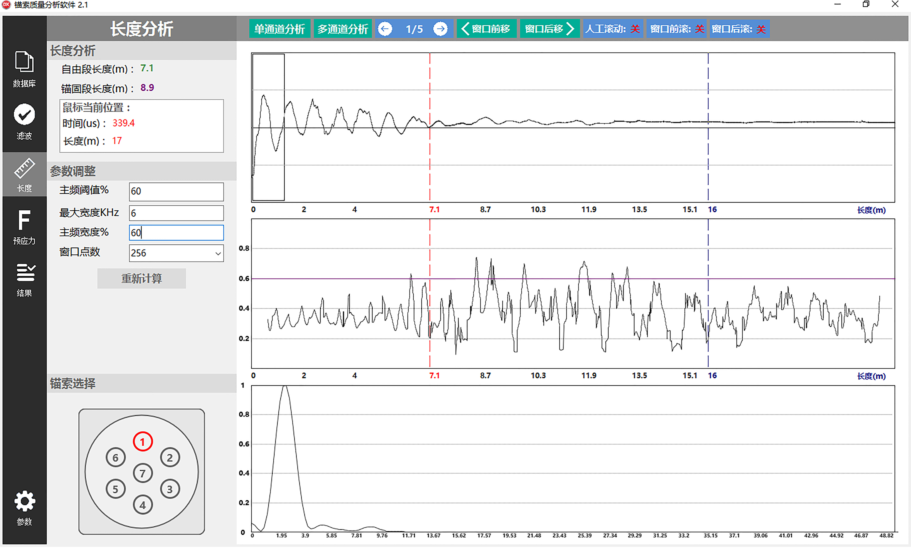
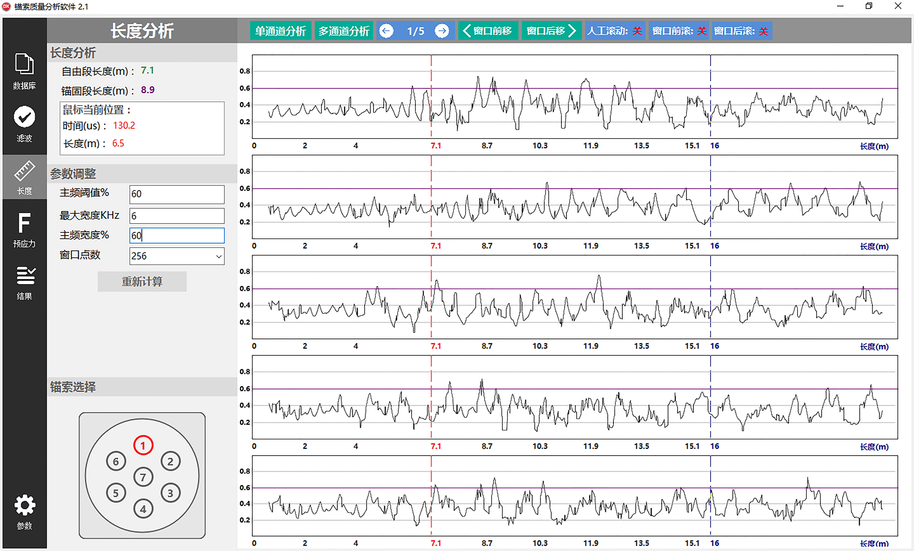
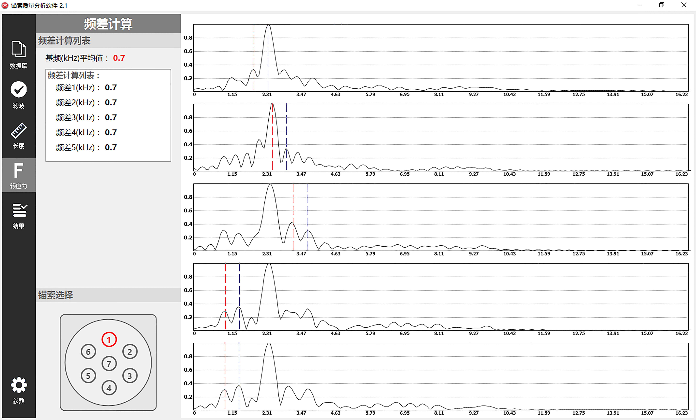

**Tip**:  This page can be translated by *Chrome Google Translate*

**提示**: 本页面支持Chrome Google翻译

***

# SHM_StructuralHealthMonitoring
[本科大学生创新项目] 结构健康监测SHM：预应力锚索无损检测分析(技术：DSP、FFT、STFT、Delphi)

# 简介  
针对目前阶段对预应力锚索的无损检测数据分析不够系统、分析方法仍有不足的现状，设计并实现了预应力锚索无损检测数据分析系统。

>**(1)在理论、算法研究及创新方面:** 首先，通过快速傅里叶变换FFT对采集的数据进行滤波；通过短时傅里叶变换STFT对信号进行时频特征分析；在已有的信号处理方法的基础上提出“STFT主频幅值比法”求解预应力锚索自由段、锚固段长度；最后，利用频差法求解预应力大小。

>**(2)在软件系统实现方面:** 根据对锚索无损检测数据分析的任务需求及模块化编程思想将软件分为四个层面（数据访问及管理层、数据计算层、绘图及操作层、结果计算及展示层）；同时基于MVC框架思想、DirectX设计软件核心内容：模型计算、绘图及控制框架。最后，通过Delphi编程设计并实现软件系统。

## 1.软件系统界面展示：

### 主页-锚索数据库

### 带通滤波-FFT

### 长度计算-STFT时频特征分析

### 长度计算-“STFT主频幅值比”模型

### 频差计算（由“频差法”计算预应力）

# License
[MIT](./LICENSE)
