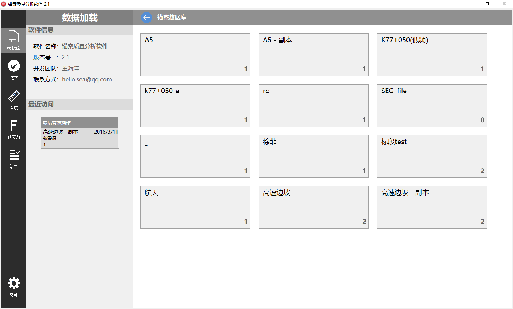

# SHM_StructuralHealthMonitoring
[本科大学生创新项目] 结构健康监测SHM：预应力锚索无损检测分析(技术：DSP、FFT、STFT、Delphi)

## 1.软件系统界面展示：

### 主页-锚索数据库

### 带通滤波-FFT

### 长度计算-STFT时频特征分析

### 长度计算-“STFT主频幅值比”模型

### 频差计算（由“频差法”计算预应力）

